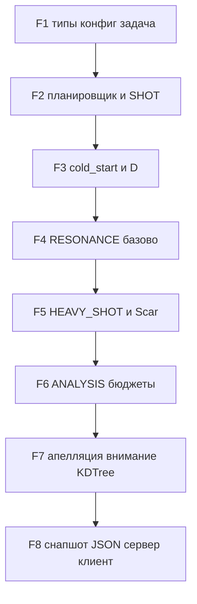

# План реализации Nodes.jl (после env)

Откройте этот файл из панели **Plans** в чате агента или через проводник: кнопка **Build** появляется у планов в `.cursor/plans/` при `isProject: true`.

## Исходная точка

- Модуль: [src/Nodes.jl](../src/Nodes.jl) — заглушка.
- Зависимости уже покрывают приоритетную очередь (`DataStructures`), `StaticArrays`, `NearestNeighbors`, `HTTP`, `WebSockets`, `JSON3`.

## Зафиксированные решения (согласовано с заказчиком)

- **Первая «готовая» веха:** headless-симуляция + тесты; **JSON-снимок** (лог/файл) сразу после стабильного `tick!` — по желанию; **HTTP/WebSocket + `web/`** — отдельным этапом (фаза 8).
- **Прикладная задача:** факторизация составных **N = p·q**, p и q простые **разной длины**, порядка **10–20 десятичных знаков** (ещё не «криптостойко», но без полного перебора).
- **L5 (мощный выстрел):** Pollard’s rho с разными стартами; **L1–L4:** быстрые эвристики перспективности параметров (старт `start_x`, коэффициент `poly_coeff` в f(x)=x²+c и т.п.); результат L5 объективно проверяется делимостью.
- **Диссонанс `D`:** вклад уровня `k` = `metric_weights[k] * normalize(task, Lk, raw_k)`; **`normalize`** — метод `AbstractTask`, гарантирует **∈ [0, 1]** до суммирования (см. фаза 3). Сырые значения `evaluate` могут быть в произвольной шкале — нормализация не «размазывается» неявно.
- **Идентификаторы узлов:** в `Environment` поле **`next_id::UInt64`**, инкремент при каждом создании узла (проще внешней фабрики).
- **Шрамы без `embed`:** не «пропуск», а **запрет точного совпадения** набора параметров с `scar.center` (по согласованному набору ключей задачи); **с `embed`:** расстояние в пространстве эмбеддинга меньше `radius` (радиус и центр для PollardFactoringTask — простой скаляр/короткий вектор на фазе 5; уточнение метрики — вместе с `embed`).
- **Фаза 4 / фаза 7:** выбор партнёра **без `embed`** — **случайная** допустимая пара; **KDTree** и осмысленные расстояния — **фаза 7**, не блокер для RESONANCE v0.
- **Фаза 8:** `manual_events` — **`Channel` с буфером** (например 64–256, параметр в `Settings`), продюсер WebSocket не блокируется при кратковременном отставании главного цикла; потребитель в симуляции — **неблокирующий** `take!`/`fetch` с try/поллирование или `isready` (зафиксировать один стиль в коде).

## Принцип разбиения

Реализуем «вертикальные» срезы по механизмам; **первая поставляемая версия — без UI**, с модулем задачи **PollardFactoringTask** (интерфейс §6 AGENTS), без отдельной «DemoTask», кроме минимальных юнит-тестов ядра при необходимости.

## Фаза 1 — Базис данных и контракт задачи

**Цель:** компилируемый код, который отражает §2 и §6 ТЗ без симулятора.

1. Новые файлы подключать из корневого [src/Nodes.jl](../src/Nodes.jl): например `types.jl`, `config.jl`, `task_api.jl`.
2. **Типы** строго по ТЗ AGENTS §2:
  - `mutable struct Node`, `struct Scar`, `mutable struct Environment`, `@enum EventType`, `struct Event`.
  - `abstract type MetricLevel` и `struct L1`…`L5` (§3).
  - В `Environment`: поле **`next_id::UInt64`**; при создании каждого нового узла — уникальный id и `next_id += 1` (потокобезопасность оставить на однопоточный симулятор в v0; при появлении `@spawn` — заменить на атомик или блокировку).
3. **`Settings` или `HyperParams`** (`config.jl`): значения §7.1 как структура — `cost::SVector{5,Float64}` или `Vector{Float64}`, `analysis_interval`, `cold_start_ticks`, `D_thresh`, порог `HEAVY_SHOT` по hp, `ε` для шрамов, `stuck_ticks`, начальные `metric_weights`, `crossover_weights`, простые стартовые `α`, `β`, `γ` для §4.3 (позже заменятся обучением).
4. **Интерфейс задачи** (`AbstractTask` / `task_api.jl`):
  - `evaluate(params, ::Type{<:MetricLevel})::Tuple{Float64,Bool}` — первая компонента **сырая** оценка качества (шкала задачи); вторая — флаг успеха L5.
  - **`normalize(task, ::Type{<:MetricLevel}, raw::Float64)::Float64`** — приводит вклад уровня к **[0, 1]** перед взвешиванием; дефолтный метод, например `clamp(raw, 0, 1)` или сопоставление фиксированным диапазонам, переопределяется в `PollardFactoringTask` при необходимости.
  - `crossover`, опционально `embed`, `generate_random_params(scars)`; вспомогательные методы для **центра/радиуса шрама** из `params` (простой скаляр или короткий вектор для первой версии факторизации).
  - Реализация **`PollardFactoringTask`** в `src/tasks/pollard.jl` (или аналог): N в `params` как `BigInt` для 10–20+ десятичных знаков; L1 малые простые; L2 короткий rho; L3/L4 — нарастающее число итераций; L5 полный лимит итераций; операторы `crossover` (`:swap_start`, `:swap_coeff`, `:average`, `:random_mid` и т.д.). Минимальный **заглушечный** тип для тестов ядра без тяжёлой арифметики — по необходимости отдельный файл, не вместо Pollard.
5. **Тесты:** конструкторы, инкремент `next_id`, smoke `evaluate` на малых N, создание `Environment` с `PriorityQueue` и каналом `Channel{Event}(n)`.

**Примечание по очереди:** в `DataStructures.PriorityQueue` приоритет — **минимальный** первым (`peek`/`dequeue!`). При планировании из §4.1 либо кладём **отрицательный приоритет** `(-priority)`, либо оборачиваем `(priority, tie_breaker)` с обратным порядком — зафиксировать один способ во всех местах документацией в одной строке в коде.

## Фаза 2 — Создание среды, планировщик, один такт SHOT / MANUAL

**Цель:** минимально полезный главный такт без полной сложности.

1. `Environment` создание из `Settings` и `AbstractTask`:
  - `nodes` через `generate_random_params` или прямое заполнение;
  - очередь событий пустая в начале каждого **под-прохода** или заполняется в `tick!` перед `dequeue!` — предлагается **пересборка очереди в начале такта** (проще отлаживать; оптимизация «перекладки» очереди — позже, §8).
2. Выбор следующего события: канал `manual_events` (см. [AGENTS.md](../AGENTS.md)) с неблокирующим `poll` перед очередью; **MANUAL** с приоритетом 999 переводится в немедленное выполнение (при простой модели можно класть в начало deque списком или использовать отдельный «экспресс-холд».
3. **Обработчик `SHOT`**, упрощённый §4.2:
  - выбор минимальной доступной глубины L по `cost[L] ≤ hp`, с учётом **cold_start** §7.3 к концу фазы 3;
  - вызов задачи `evaluate`; обновление `hp`, простая аппроксимация `D` (см. фазу 3);
  - **апелляцию** можно отложить до фазы 7 — в фазе 2 закомментировать/hook заглушка.
4. **MANUAL**: парсинг `payload` — минимум «добавить узел с params» или no-op заглушка с логированием счётчика.
5. **Тест:** несколько тактов симуляции, узел теряет `hp`, `D` меняется.

## Фаза 3 — Диссонанс, метрики, холодный старт §7

1. **Нормализация и `D`:** после каждого вызова `evaluate` для уровня `L` получаем `raw`. Вклад в диссонанс: `metric_weights[iL] * normalize(task, L, raw)` где `iL` — индекс 1..5 для L1..L5. **Сумма взвешенных нормализованных вкладов** (и при необходимости повторная `clamp` итогового `D` в [0,1], если веса не суммируются в 1 — зафиксировать в `Settings`: либо веса нормированы, либо итог делится на `sum(weights)`). Неиспользуемые уровни: вес 0 или не обновлять компоненту.
2. **`PollardFactoringTask`:** по возможности возвращать из `evaluate` уже осмысленную шкалу; **обязательная** ступень — `normalize`, чтобы ядро не зависело от «магии» диапазона.
3. **Cold start:** флаги/`tick` счётчик до `cold_start_ticks`: бесплатные L1–L2, без резонансов, без записи шрамов, exploration 100%.
4. **Тест:** после cold start включаются полные правила затрат; unit-тесты на `normalize` + искусственные `raw`.

## Фаза 4 — RESONANCE (базово) §4.3 и §5 (внимание v0)

1. Выбор активного узла из популяции (например, максимальный `hp` среди активных или round-robin).
2. Выбор партнёра **`B`:** если задача реализует `embed` — расстояние в ℝⁿ (например евклидово) + шум, масштабируемый `exploration_budget`; **если `embed` нет** — **случайная** допустимая пара среди активных/спящих с положительным `mp` (как согласовано: для фазы 4 достаточно). **KDTree и выбор по ближайшим соседям** — перенос на **фазу 7**, не блокер v0.
3. `crossover` из задачи, число оффспринг `N ~ max(1, round(...))`; отбор по `evaluate(..., L1)` и `evaluate(..., L2)` минимальной стоимостью.
4. Налог в `exploration_budget` от hp лучшего потомства; обновление `resonance_memory` по паре ключей упорядоченных `(min_id, max_id)`.

## Фаза 5 — HEAVY_SHOT и шрамы §4.4 (KD и метрика дистанции — фаза 7)

1. Условия доступа §4.4 и вызов L5 (`success_flag` второго возврата `evaluate`).
2. При успехе — точка расширения «останов с результатом» (настройка симулятора: `stop_reason`).
3. При провале — «обнулить» hp, `mp_frozen`, создать `Scar`: **`center` и `radius`** задаёт `PollardFactoringTask` (простой скаляр или очень маленький случайный/фиксированный вектор на первой версии; при появлении полноценного `embed` — согласовать центр/radius с метрикой расстояния).
4. **`ScarDecay` / `current_potential(scar, tick)`:** экспоненциально по §2 AGENTS.
5. **Разрушение шрамов** при `D < 0.2`: при наличии `embed` — расстояние между `embed(params)` и эмбеддингом центра шрама **меньше** `radius` (или эквивалент в пространстве задачи); **без `embed`** — узел считается в «области» шрама, если **точное совпадение** контролируемых параметров с `scar.center` (**запрет повтора** конфигурации после провала L5). Генерация `generate_random_params` и мутации должны **отфильтровывать** запрещённые наборы.

## Фаза 6 — ANALYSIS и балансировка §4.5

Упрощённые подпункты, затем ужесточение:

1. Каждые `analysis_interval`: затухание/удаление шрамов, удаление узлов `(hp≈0 && mp≈0 && !mp_frozen)` с аккуратным сравнением float.
2. **Калибровка метрик** — сначала заглушка (смещение `metric_weights` на ε по фиксированному правилу с фиктивными данными); полноценная корреляция L3/L4 — после накопления истории узлов или отдельного буфера измерений.
3. **`stuck_ticks` / средний D:** хранить кольцевой буфер последних средних или скользящее окно — перекладывание между `exploration_budget` и `exploitation_budget` §4.5 пункт 3.
4. **Разморозка mp** после N успешных резонансов — счётчик на узле (добавить поле если нужно) или использовать `heavy_shots`/`mating_history` по ТЗ-интерпретации — зафиксировать один механизм в коде.

## Фаза 7 — Углубление гомеостаза §4.2–§5 (по желанию перед UI)

1. Полная **апелляция** условием L3 vs L4.
2. Обучаемое **внимание** и **выбор партнёра по расстоянию**: при наличии стабильного `embed` — **KDTree** (`NearestNeighbors`), переиндексация каждые `K` тактов или при изменении популяции; комбинация `[distance, suffering_similarity, resonance_memory]` с шумом при застое.
3. **Кэш `evaluate`** (Dict ключ `(hash(params)... level)` если безопасно для задачи) — опционально за флагом в `Settings`.

## Фаза 8 — Транспорт и UX заготовка §9

1. Структура **снимка состояния** как `NamedTuple`/`struct` → `JSON3.write` узлы/шрамы/tick/метрики (глобальный средний `D`, бюджеты).
2. **`manual_events`:** создание канала **`Channel{Event}(bufsize)`** с `bufsize` из `Settings` (64–256); WebSocket-поток только `put!`, симулятор — **неблокирующее** потребление (`isready` + `take!`), чтобы продюсер не завис от редкого `tick!`.
3. **HTTP + WebSockets:** минимальный сервер-loop (можно синхронно с главным потоком в v0): отправка строки каждые 100 мс; приём JSON-команд — в буферизованный канал п. 2.
4. Статический **`web/`** с `three.js` — одна страница, сферы по `embed`/`params` если размерность 3 (иначе PCA/первые 3 координаты в задаче факторизации).
5. **Расширение полей-снимка под §9.7**: CPU заглушкой нулями на первых шагах.

## Порядок ревью PR

Разумное разбиение под «малый диф»: F1+F2 маленький PR1; F3; F4; F5; F6 — отдельно; F8 отдельно от ядра.

## Риски и допущения

- **Приоритеты и порядок** двух одинаковых событий: ввести `sequence::UInt64` в `Event` или не полагаться на стабильность порядка в HEAP.
- **Потокобезопасность:** симуляционный цикл в v0 — **однопоточный**; параллелизм `@threads`/`@spawn` — позже (§8 AGENTS). **WebSocket → `manual_events`:** буферизованный `Channel` + неблокирующее чтение в главном цикле, чтобы избежать взаимных блокировок продюсера и потребителя.
